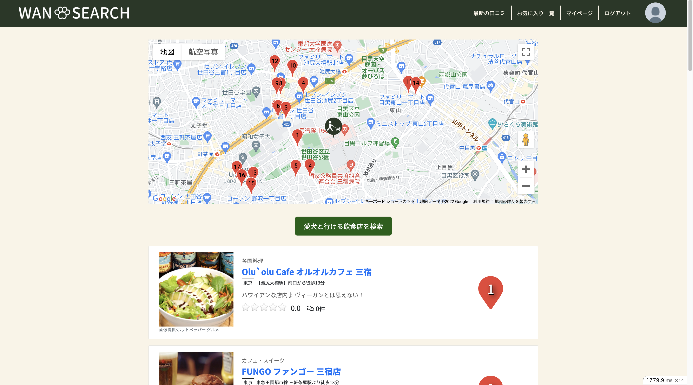
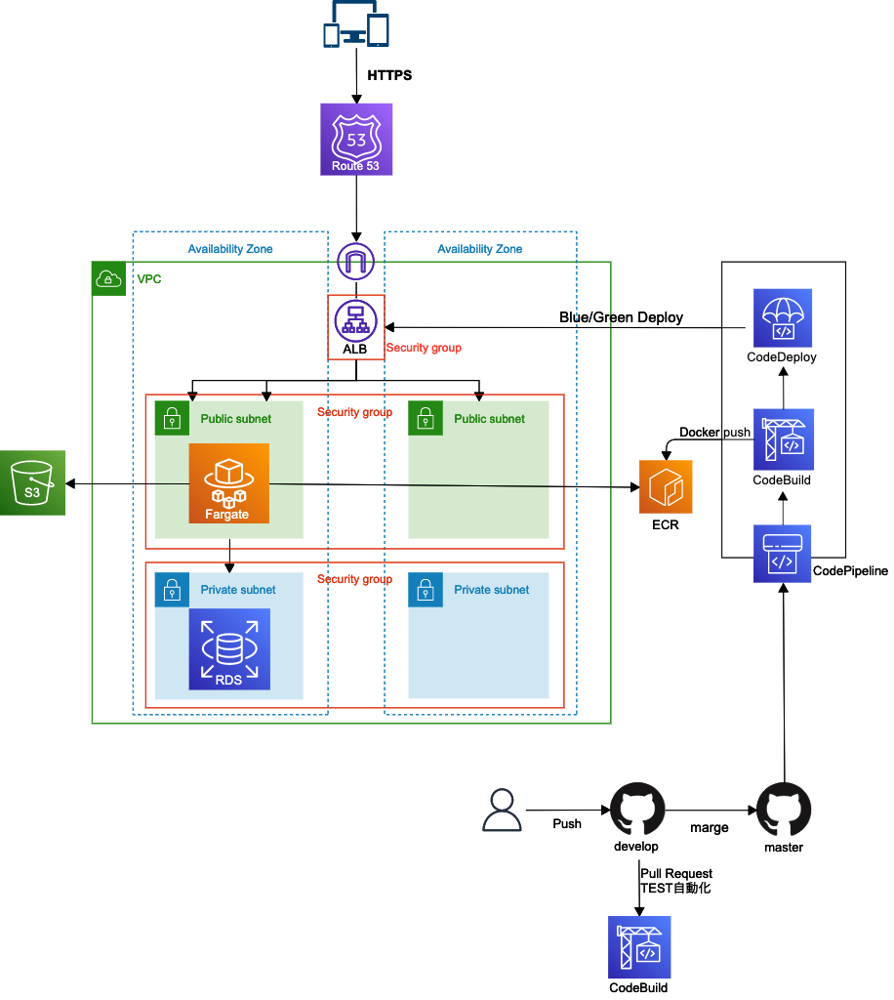
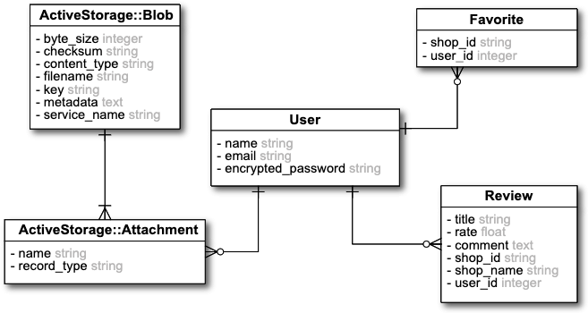
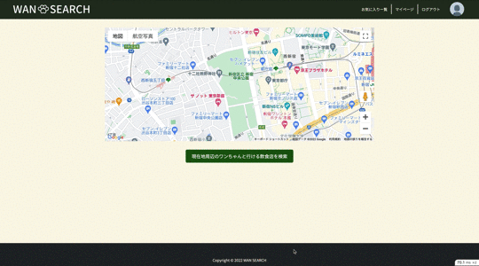
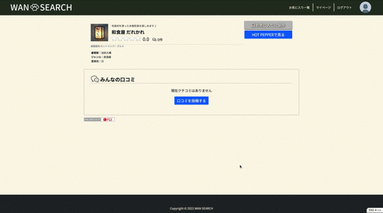
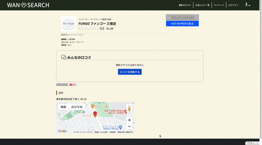

# WAN SEARCH (ワン サーチ)
  
現在地周辺のペット可のお店をホットペッパーAPIから検索し、GOOGLE MAP上に表示するアプリケーションです。

## URL
https://wan-search.com

## 制作背景
愛犬と散歩に行って一休憩...と思いきや意外とペット可のお店を知りませんでした。  
グルメ検索サイトで調べようと思っても条件設定を開いて設定しなければならず、検索しても検索結果は基本リスト表示です。  
ペットを飼っている友人に聞くも、やはりあまり知らないか、いつも行くお店が固定だったり。  
そこで、MAPで直感的に現在地周辺のペット化のお店が調べられたらと思いWAN SEARCHを作成しました。  
愛犬家たちが、愛犬と色々な場所に出かけられるようになると嬉しいです。

## ゲストログイン
新規登録画面またはログイン画面から「ゲストログイン」ボタンを押下してください。

## 使用技術
- Ruby 3.1.0
- Ruby on Rails 6.1.4.4
- MySQL 8.0
- Nginx
- Puma
- AWS
  - VPC
  - ECS
  - Fargate
  - ECR
  - RDS
  - Route53
  - S3
  - ALB
  - Code Deploy
  - Code Build
  - Code Pipeline
- Docker/Docker-compose
- RSpec
- Google Maps API
- ホットペッパーグルメサーチAPI

## AWS構成図  
  

### CI/CD
- Githubにてプルリクエストが出された時、またはプルリクエストが更新されたときにCodebuildによってRSpecが自動で実行されます。
- 開発ブランチがmasterブランチにマージされると、DockerイメージのPushとBlue/Greenデプロイが自動で実行されます。

## ER図  
  

## 機能一覧
- 現在地周辺のショップ検索機能
  - 現在地取得(Geolocation API)
  - ホットペッパーグルメAPIのデータベースを利用
  - GOOGLE MAPに現在地とショップにピンを立てる  
  
- ユーザー登録、ログイン機能(devise)
- お気に入り機能(Ajax)　　  
  
- レビュー機能(Ajax)  
  
- マイページ
  - アイコン画像、名前、メールアドレス、パスワード変更可能
  - 自分のお気に入り一覧(Ajax通信で削除可能)
  - マイレビュー一覧(Ajax通信で編集・削除可能)
- 最新のレビュー一覧(10件まで表示)
- ショップ詳細ページでのGoogle Map表示

## テスト
### RSpec
- 単体テスト(Model Spec)
- 結合テスト(Request Spec)
- システムテスト(System Spec)

## 実装予定の機能
- レスポンシブ対応
- キーワード検索（ex.駅名で検索）
- フォロー機能
- レビューの画像投稿機能
